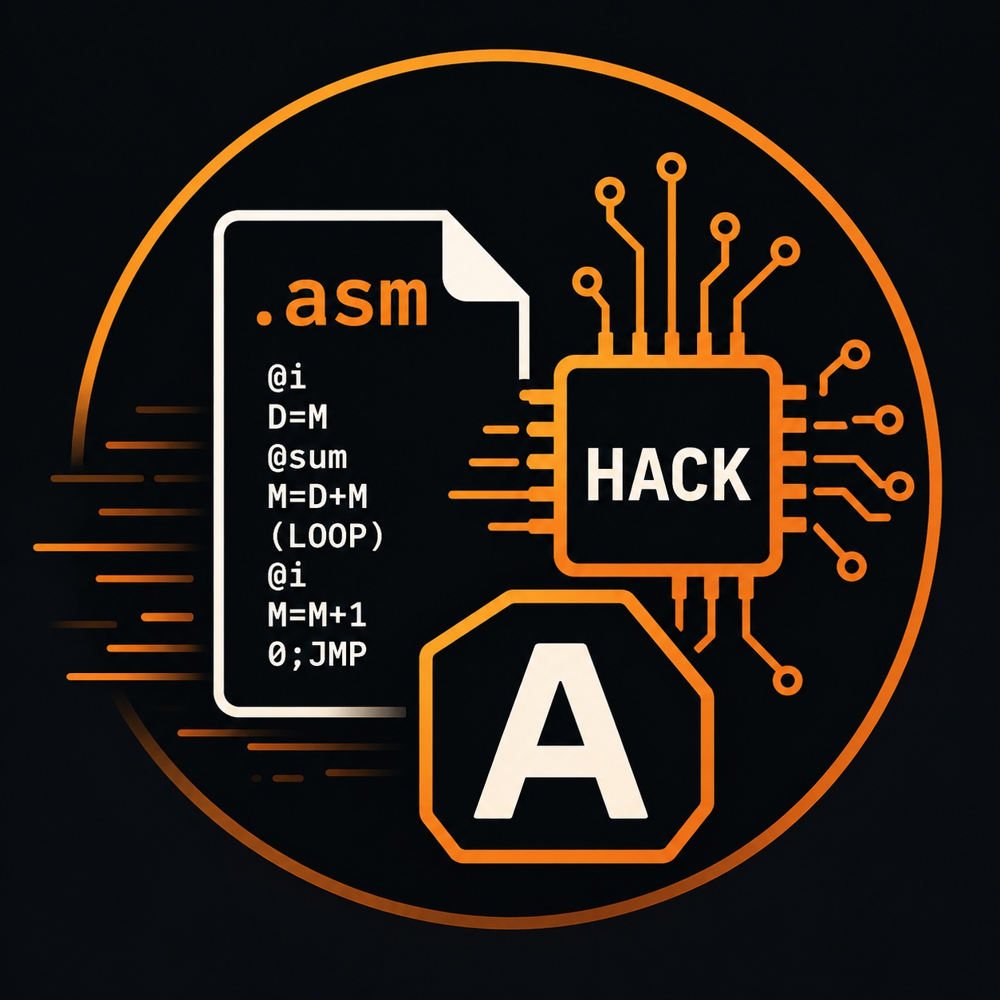

# 🧠 Hack Assembler (Nand2Tetris)

<p align="center">
  
</p>

A low-level assembler written in **C**, built as part of the *Nand2Tetris* course/book exercises.

This project implements a complete assembler for the **Hack computer**, translating `.asm` assembly files into `.hack` machine code.

---

## 📌 Overview

The Hack computer architecture (from *Nand2Tetris*) uses a simple assembly language designed for educational purposes.

This assembler converts Hack assembly into 16-bit binary instructions that can be executed by the Hack CPU emulator.

It supports:

- A-instructions (`@value`)
- C-instructions (`dest=comp;jump`)
- Labels `(LOOP)`
- Variables (`@i`, `@sum`, etc.)

---

## ⚙️ Features

- ✅ Two-pass assembly process
- ✅ Symbol table implementation
- ✅ Label resolution
- ✅ Variable allocation starting from RAM[16]
- ✅ Full support for Hack assembly specification
- ✅ Clean modular C architecture
- ✅ Outputs `.hack` binary file compatible with Nand2Tetris CPU emulator

---

## 🏗️ How It Works

### 🔁 Pass 1: Symbol Resolution
- Scans the file
- Detects labels `(LABEL)`
- Stores label addresses in the symbol table

### 🔁 Pass 2: Code Generation
- Parses instructions line by line
- Translates:
  - A-instructions → 16-bit binary
  - C-instructions → computation + destination + jump binary encoding
- Resolves variables and symbols

---

## 📁 Project Structure
```text
.
├── src/
│   ├── main.c              # Entry point
│   ├── parser.c            # Instruction parsing logic
│   ├── parser.h
│   ├── code.c              # Translates mnemonics to binary
│   ├── code.h
│   ├── symbol_table.c      # Symbol management
│   ├── symbol_table.h
│   └── assembler.c         # Core orchestration logic
├── bin/                    # Compiled binary output
├── tests/                  # Sample .asm files
├── Makefile
└── README.md
```
---

## 🔧 Build Instructions

### Compile the project:

```bash
make
```
---
▶️ Usage

Run the assembler with an .asm file:
---
📄 License

This project is created for educational purposes as part of the Nand2Tetris learning journey.